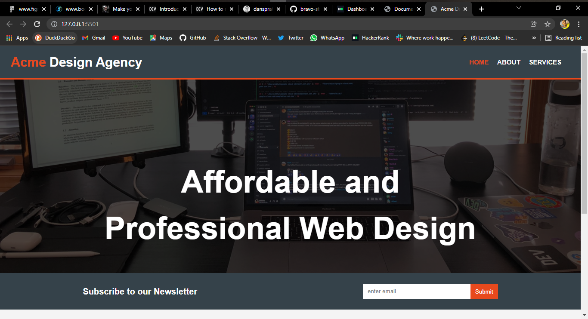
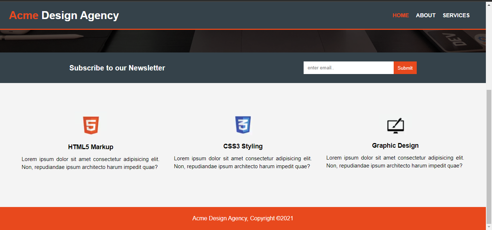
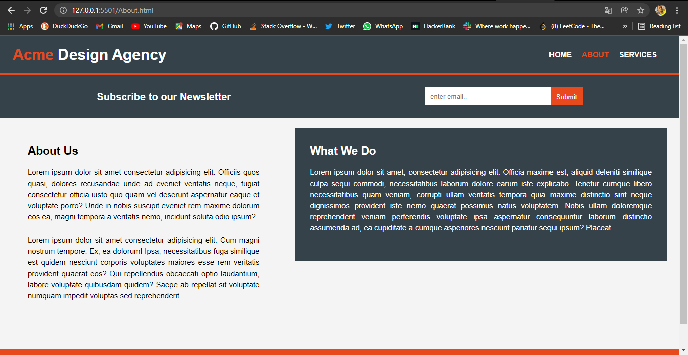
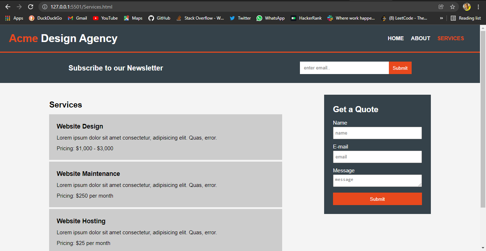
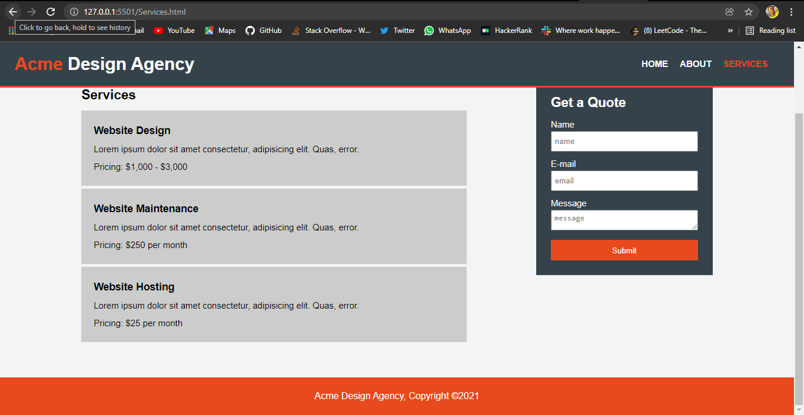

# ACME Design Agency

## This project was created for educational purpose; i.e a way of showcasing my CSS Skill, and practicing what i've learnt overtime.

## Below are screenshots of the web app:
 

### Homepage

 

### Homepage-scroll down

 

### About

 

### Services

 

### Services-scroll down

 
 

## Credit: Brad Traversy
### Github: [github.com/bradtraversy](https://github.com/bradtraversy)
### website: [traversymedia.com](https://www.traversymedia.com/)
